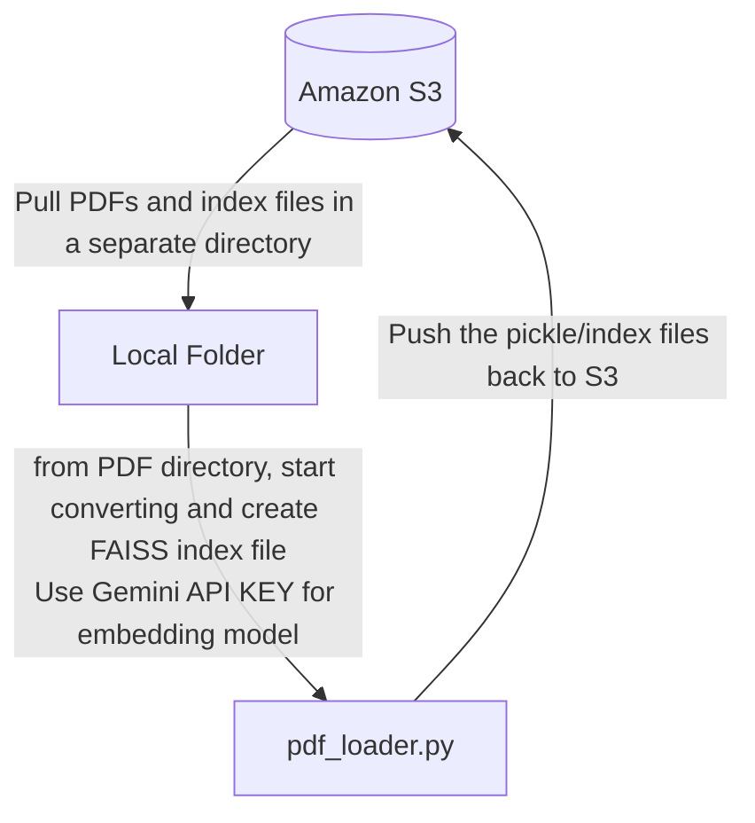
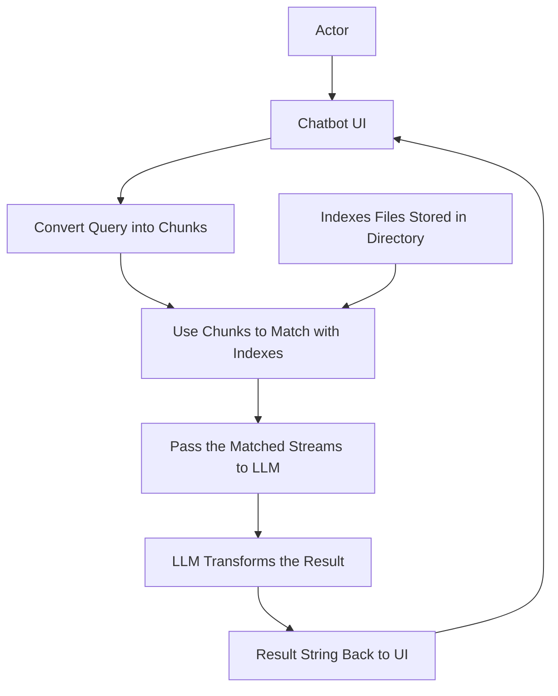

# BITS WILP Smart AI Assistant

This project is a smart assistant designed to process PDF documents, extract their content, and store the extracted data in a FAISS (Facebook AI Similarity Search) vector store. The project also includes functionality for interacting with AWS S3 for downloading and uploading files.

## Problem Statement

- To enhance the student experience and streamline academic support, we aim to build a Smart AI Chatbot tailored for the BITS Pilani Work Integrated Learning Program (WILP)  
- This chatbot will provide students with instant, 24/7 support for their academic and administrative queries, personalized learning resources, and seamless access to program information
- It will leverage AI to offer context-aware responses, track students' learning progress, and provide tailored assistance to help them manage assignments, deadlines, and other academic activities efficiently

## Market survey

- Retrieval Augmented Generation (RAG) technique in AI is widely used solution by many organization to build Smart AI Chatbots for their custom data.
- A similar tool is provided by AnythinLLM as a local application, however this is not a good fit for a customer facing application.

## USP

- 24/7 Accessibility
- Comprehensive Academic Resource
- Real-time Guidance
- Time-Saving for Faculty and Support Staff

## How it fills the Gap?

- The BITS WILP Smart AI Chatbot can bridge significant gaps in the educational experience by addressing specific needs of students, faculty, and administrative staff.
- Real-Time Student Support
- Streamlined Administrative/Academic Queries

## Components Overview

We have make an active effort to maintain modularity such that the code is easy to scale and adaptable to similar use cases and maintain upgradability.

### PDF Loader

The PDF loader script is designed to automate the entire process of downloading, processing, and uploading files. Below is the flow of the function: 

1. **Trigger**: The function is triggered by a cronjob (scheduled event).
2. **Download**: The function downloads the PDF files from the S3 bucket.
3. **Process**: The PDFs are processed, and the text is extracted and added to the FAISS vector store.
4. **Upload**: The updated FAISS vector store is uploaded back to the S3 bucket.



- The PDFs are stored in a S3 bucket and accessed using boto3.
- The vectorizer is trained using `GoogleGenerativeAIEmbeddings`'s model `models/embedding-001`.

    ```python
    # simplified code block
    # Create embeddings
    embedding_model = GoogleGenerativeAIEmbeddings(model="models/embedding-001")
    vectorstore = FAISS.load_local(faiss_index_path, embedding_model, allow_dangerous_deserialization=True)

    for pdf_path in pdf_paths:
        # Load PDF
        loader = PyPDFLoader(pdf_path)
        data = loader.load()

        # Split text
        text_splitter = RecursiveCharacterTextSplitter(chunk_size=1000)
        docs = text_splitter.split_documents(data)

        # Add new documents to the vector store
        vectorstore.add_documents(docs)

    # Save the updated vector store
    vectorstore.save_local(faiss_index_path)

    ```

### Chatbot



- This component is responsible for providing a chatbot interface to users.
- On every msg query, the Vector Store is queried for relevant documents using FAISS and then a response is generated using `GoogleGenerativeAIEmbeddings` model `models/response-001`.

    ```python
    embedding_model = GoogleGenerativeAIEmbeddings(model="models/embedding-001")
        vectorstore = FAISS.load_local(
            "static/faiss_index",
            embedding_model,
            allow_dangerous_deserialization=True
        )
    ```

- LLM model used is `ChatGoogleGenerativeAI`'s `gemini-1.5-pro`
- Similarity search is then performed on the vectors loaded and the best match is sent to the LLM model for response generation.

    ```python
    vectorstore.as_retriever(search_type="similarity", search_kwargs={"k": 10})
    ```

### S3 Bucket

- This component is responsible for storing and retrieving pdfs and `FAISS Indexes`.
- Although the chatbot directly interacts with the vectorstore stored locally, `S3 Bucket` is used to maintain common context accross all chatbot instances and also allows us to hot load new pdf to the vectorstore.
- All interaction with the S3 bucket is done through `pdf_loader.py`

### Secrets Manager

- This component is responsible for storing and retrieving secrets used by the application.
- The secrets are stored in `AWS Secrets Manager` and accessed using `boto3`.

    ```python
    def set_env_variable():
        client = boto3.client(
            'secretsmanager',
            region_name=Config.REGION_NAME
        )
        api_key = client.get_secret_value(
            SecretId=Config.SECRET_RECORD
        )['SecretString']

        os.environ['GOOGLE_API_KEY'] = json.loads(api_key).get('GOOGLE_API_KEY')
    ```

## AWS

### AWS Architecture

The project leverages AWS services to handle the processing and storage of PDF documents. Below is an overview of the AWS architecture used in this project:


1. **S3 Buckets**: Used for storing the PDF files and the FAISS vector store.


2. **Secrets Manager**: Stores a key-value pair, protecting secret values.


3. **IAM Roles**: Ensures secure access to the S3 buckets and other AWS resources.


4. **IAM Policy**: Defines the permissions for the IAM roles to interact with AWS services securely.


## Setup

### Prerequisites

- Python 3.11
- Docker
- AWS CLI configured with appropriate credentials

### Installation

1. Clone the repository:

    ```sh
    git clone https://github.com/yourusername/bits_chatbot_cc.git
    cd bits_chatbot_cc
    ```

2. Install the required Python packages:

    ```sh
    pip install -r requirements.txt
    ```

3. Set up environment variables:

    Create a `.env` file in the root directory and add the following variables:

    ```env
    GOOGLE_API_KEY=your_gemini_api_key 
    AWS_ACCESS_KEY_ID=your_aws_access_key_id
    AWS_SECRET_ACCESS_KEY=your_aws_secret_access_key
    ```

## Usage

### Local Execution

1. Process the PDFs and update the FAISS vector store (Downloads PDFs from S3 and also updates the vector files over S3):

    ```sh
    python src/pdf_loader.py
    ```

2. To have the chatbot running in your machine, use:

    ```sh
    streamlit run src/bits_chatbot.py
    ```

### Docker

1. Build the Docker image:

    ```sh
    docker build -t bits_chatbot_cc .
    ```

2. Run the Docker container:

    ```sh
    docker-compose up
    ```


## Environment Variables

The following environment variables need to set:

- `GOOGLE_API_KEY`: API key for the language model.

## Docker

The project includes a `Dockerfile` and `docker-compose.yml` for containerized deployment.

### Dockerfile

The `Dockerfile` sets up the environment with necessary dependencies and installs the required Python packages.

### docker-compose.yml

The `docker-compose.yml` file defines the services and their configurations.

## Contributing

Contributions are welcome! Please open an issue or submit a pull request.

## License

This project is licensed under the MIT License.
